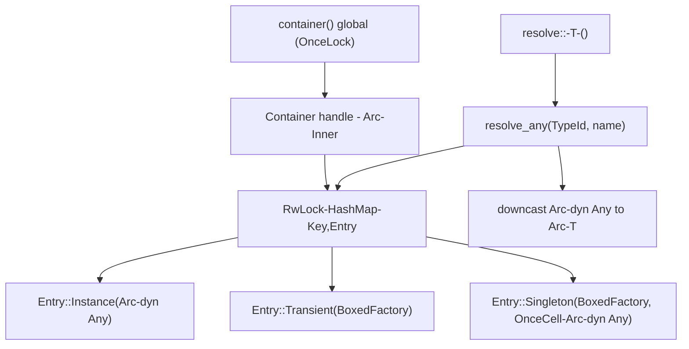

# Core Container Design

**Spec**: `.specs/features/core-container/spec.md`
**Context**: `.specs/features/core-container/context.md`
**Status**: Draft

---

## Architecture Overview

`Container` é um handle barato de clonar (`Arc` por dentro) sobre um `Inner` com 1 tabela de entradas indexada por `(TypeId, Option<nome>)`. Cada entrada guarda um "provider" — como produzir `Arc<dyn Any + Send + Sync>` — mais, no caso singleton, uma célula de cache preenchida uma única vez (mesmo sob concorrência).

Toda resolução passa por `resolve_any(TypeId, Option<&str>) -> Result<Arc<dyn Any + Send + Sync>, RudiError>` (privado), que o `resolve::<T>()` público faz downcast em cima. `bind::<Impl, dyn Port>()` é açúcar sobre `register_singleton`-like, registrando a chave de `dyn Port` (via `TypeId::of::<dyn Port>()` não existe diretamente pra unsized — solução: registra sob o `TypeId` do *tipo alvo de resolução*, que é sempre `Arc<dyn Port>`; ver seção Tech Decisions).



---

## Code Reuse Analysis

Projeto novo (repo vazio, só `METACODE.md` existia antes deste spec) — nada a reutilizar do próprio código. Reuso é de crates do ecossistema:

| Componente externo | Como usar |
| --- | --- |
| `tokio::sync::{OnceCell, RwLock}` | Primitivas async runtime-agnósticas (não exigem `#[tokio::main]` do consumidor, só await de algum executor) — usadas pro cache de singleton e pra tabela de entradas |
| `thiserror` | Deriva `RudiError` (enum único, decidido em context.md) |
| `std::any::{Any, TypeId, type_name}` | Type erasure + mensagens de erro legíveis |

---

## Components

### `Container` (handle público)

- **Purpose**: API pública de registro/resolução; clone barato (Arc por dentro), sem estado próprio além do ponteiro.
- **Location**: `crates/rudi/src/container.rs`
- **Interfaces**:
  - `container() -> Container` (fn livre no crate root, `src/lib.rs`) — pega/inicializa o singleton global via `OnceLock<Container>`
  - `Container::new() -> Container` — cria container **local** (não-global), usado internamente por `container()` e futuramente por M3 (`testing::with_container`); não é `pub` na v1 fora do crate — ver Tech Decisions
  - `register_instance<T: Send + Sync + 'static>(&self, value: T)`
  - `register_instance_named<T: Send + Sync + 'static>(&self, name: impl Into<String>, value: T)`
  - `register_transient<T, F, Fut>(&self, builder: F)` onde `F: Fn(Container) -> Fut + Send + Sync + 'static`, `Fut: Future<Output = T> + Send + 'static`
  - `register_singleton<T, F, Fut>(&self, builder: F)` (mesma assinatura de `register_transient`, mas cacheia)
  - `register_transient_named` / `register_singleton_named` — variantes nomeadas
  - `bind<Impl, Port: ?Sized + 'static>(&self)` onde `Impl: Port + Send + Sync + 'static` e `Impl` tem builder registrado via `Injectable`-like closure (v1 sem macro: aceita builder explícito — ver `bind_with`)
  - `bind_with<Impl, Port: ?Sized + 'static, F, Fut>(&self, builder: F)` — versão explícita de `bind` pra M1 (sem `#[injectable]` ainda), registra `Impl` como singleton e expõe resolução via `Arc<Port>`
  - `resolve<T: Send + Sync + 'static>(&self) -> impl Future<Output = Result<Arc<T>, RudiError>>`
  - `resolve_named<T: Send + Sync + 'static>(&self, name: &str) -> impl Future<Output = Result<Arc<T>, RudiError>>`
- **Dependencies**: `Inner` (privado)
- **Reuses**: n/a (componente raiz)

### `Inner` (estado privado)

- **Purpose**: Tabela de entradas + lock de registro.
- **Location**: `crates/rudi/src/container.rs` (mesmo arquivo, não exposto)
- **Interfaces**: `entries: RwLock<HashMap<Key, Entry>>`
- **Dependencies**: `Key`, `Entry`
- **Reuses**: —

### `Key`

- **Purpose**: Identidade de uma entrada — tipo + nome opcional.
- **Location**: `crates/rudi/src/container.rs`
- **Interfaces**: `struct Key { type_id: TypeId, name: Option<Box<str>> }` com `Hash + Eq`
- **Dependencies**: `std::any::TypeId`
- **Reuses**: —

### `Entry`

- **Purpose**: Como resolver 1 chave.
- **Location**: `crates/rudi/src/container.rs`
- **Interfaces**:
  ```rust
  type BoxedFuture = Pin<Box<dyn Future<Output = Result<Arc<dyn Any + Send + Sync>, RudiError>> + Send>>;
  type BoxedFactory = Arc<dyn Fn(Container) -> BoxedFuture + Send + Sync>;

  enum Entry {
      Instance(Arc<dyn Any + Send + Sync>),
      Transient(BoxedFactory),
      Singleton { factory: BoxedFactory, cell: Arc<tokio::sync::OnceCell<Arc<dyn Any + Send + Sync>>> },
  }
  ```
- **Dependencies**: `tokio::sync::OnceCell`
- **Reuses**: —

### `RudiError`

- **Purpose**: Enum único de erro (decisão em context.md).
- **Location**: `crates/rudi/src/error.rs`
- **Interfaces**:
  ```rust
  #[derive(thiserror::Error, Debug)]
  pub enum RudiError {
      #[error("type not registered: {type_name}{}", name.as_deref().map(|n| format!(" (name: {n})")).unwrap_or_default())]
      NotFound { type_name: &'static str, name: Option<String> },

      #[error("failed to build {type_name}: {source}")]
      BuildFailed { type_name: &'static str, source: Box<dyn std::error::Error + Send + Sync> },

      #[error("registered value for {type_name} could not be downcast (bug in rudi or type collision)")]
      DowncastFailed { type_name: &'static str },
  }
  ```
- **Dependencies**: `thiserror`
- **Reuses**: —

---

## Data Models

Não há modelo de domínio/persistência — dados internos são só `Key`/`Entry` acima.

---

## Error Handling Strategy

| Error Scenario | Handling | User Impact |
| --- | --- | --- |
| `resolve::<T>()` sem registro | `RudiError::NotFound` | `Err` tipado, consumidor decide (panic próprio, fallback, etc) — CORE-02 |
| Builder de factory/singleton retorna `Err` | Builder assina `-> Result<T, E: Error+Send+Sync+'static>`; container envolve em `RudiError::BuildFailed` | CORE-05 |
| Downcast falha (não deveria ocorrer em uso normal — só se houver bug interno ou 2 `TypeId` colidindo, o que não acontece em Rust seguro) | `RudiError::DowncastFailed` | Defesa, não fluxo esperado |
| Named resolve com nome inexistente mas tipo existente sem nome | `NotFound` inclui `name` no erro pra diferenciar de "tipo nunca registrado" — CORE-08.3 | Mensagem de erro deixa claro que é o nome que falta |
| 2 registros concorrentes do mesmo singleton ainda não construído | `OnceCell::get_or_try_init` garante builder roda 1x mesmo sob race — CORE-09 | Sem double-init, sem erro visível ao consumidor |

---

## Tech Decisions (only non-obvious ones)

| Decision | Choice | Rationale |
| --- | --- | --- |
| Runtime pra async | `tokio::sync::{OnceCell, RwLock}` como dependência do core (não o runtime `tokio` inteiro, só a feature `sync`) | Primitivas async que não exigem executor tokio rodando — funcionam sob qualquer runtime (`async-std`, `smol`, etc), mantendo o core "runtime-agnostic" na prática mesmo dependendo do crate `tokio` |
| `bind` sem macro na M1 | `bind_with::<Impl, Port, F, Fut>(builder)` explícito; `bind` "automático" (usando `Injectable` do tipo) só existe a partir de M2 quando a trait `Injectable` existir | Spec deste feature é só container puro; documentado em Out of Scope |
| Resolução de `dyn Port` | Chave de registro/resolução é sempre o tipo concreto que o consumidor pede em `resolve::<Arc<dyn Port>>()` — ou seja, a lib registra sob `TypeId::of::<Box<dyn Port>>()`... **problema**: `TypeId` não é obtível de `dyn Port` sozinho de forma direta pro `HashMap` porque `dyn Trait` não é `'static`-sized de forma trivialmente hasheável sem um marker. Solução adotada: `bind_with` recebe `PhantomData<Port>` via turbofish e usa `TypeId::of::<dyn Port + 'static>()` — isso **é** suportado em Rust estável (`TypeId::of` aceita `dyn Trait + 'static`). Consumidor sempre resolve via `resolve::<Arc<dyn Port>>()`, nunca `resolve::<dyn Port>()` puro (unsized, não compila) | Confirmado como padrão válido em Rust — `TypeId::of::<dyn Trait>()` funciona pra traits `'static` |
| Erro do builder genérico | `register_singleton`/`register_transient`/`bind_with` exigem builder retornando `Result<T, E>` com `E: std::error::Error + Send + Sync + 'static`, nunca `T` puro infalível | Uniformiza `BuildFailed`; builder infalível usa `Ok::<_, std::convert::Infallible>` ou helper `register_singleton_infallible` se a ergonomia pedir (avaliar em tasks) |
| Container global vs local | `Container::new()` cria instância independente; `rudi::container()` é 1 `OnceLock<Container>` no crate root que chama `Container::new()` na 1ª vez | Deixa a porta aberta pra M3 (`testing::with_container` cria um `Container::new()` isolado) sem exigir refactor depois — decisão do context.md |

---

## Open Questions carregadas do METACODE (não bloqueiam este design)

- Dependência circular: não detectada, vira deadlock em `OnceCell::get_or_try_init` recursivo (mesma task tentando re-adquirir a própria inicialização) — documentar como limitação conhecida na doc pública, sem tratamento especial na v1.
