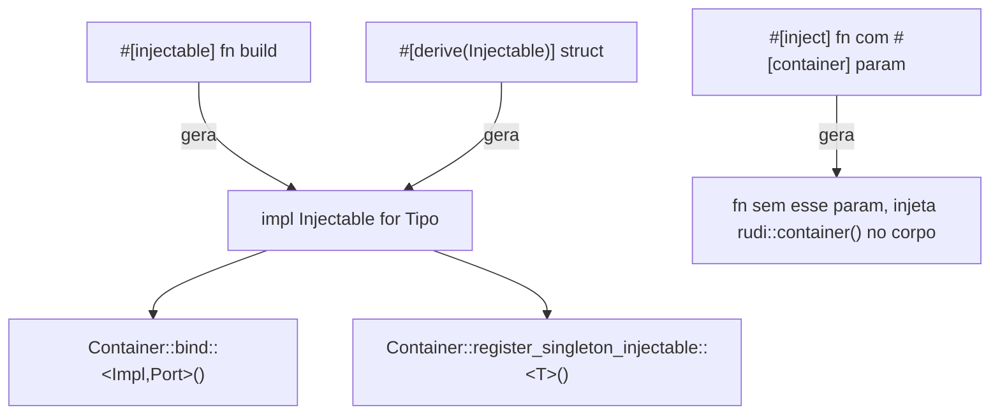

# DI Macros Design

**Spec**: `.specs/features/di-macros/spec.md`
**Context**: `.specs/features/di-macros/context.md`
**Status**: Draft

---

## Architecture Overview

2 peças novas: (1) trait `Injectable` no crate `rudi` (core) + 2 novos métodos em `Container` (`bind`, `register_singleton_injectable`) que consomem essa trait; (2) crate `rudi-macros` com 3 macros (`#[injectable]`, `#[inject]`, `#[derive(Injectable)]`) que geram código usando `syn`/`quote`, sem nenhuma lógica de runtime própria — só codegen.



**Por que `Injectable` é trait do core, não da macro**: `bind`/`register_singleton_injectable` (métodos de `Container`) precisam de um bound genérico estável em tempo de compilação — a trait tem que existir no crate `rudi` pra `rudi-macros` gerar `impl` contra ela e pro consumidor poder escrever `use rudi::{Container, Injectable};` como no METACODE.md.

---

## Code Reuse Analysis

| Componente existente | Localização | Como reusa |
| --- | --- | --- |
| `Container::register_singleton<T,F,Fut,E>` | `crates/rudi/src/container.rs` (M1) | `register_singleton_injectable` e `bind` chamam por baixo, sem duplicar lógica de cache/double-init |
| `RudiError` | `crates/rudi/src/error.rs` (M1) | `Injectable::Error` de tipos que não têm erro próprio usa `std::convert::Infallible`; erros custom do consumidor continuam passando por `RudiError::BuildFailed` do lado do container |
| `resolve`/`resolve_named` | `crates/rudi/src/container.rs` (M1) | `#[derive(Injectable)]` gerado chama `c.resolve::<TipoDoCampo>().await` campo a campo |

---

## Components

### `Injectable` (trait, novo — core)

- **Purpose**: Contrato que `#[injectable]`/`#[derive(Injectable)]` implementam, consumido por `Container::bind`/`register_singleton_injectable`.
- **Location**: `crates/rudi/src/injectable.rs`
- **Interfaces**:
  ```rust
  pub trait Injectable: Sized + Send + Sync + 'static {
      type Error: std::error::Error + Send + Sync + 'static;
      type Port: ?Sized + Send + Sync + 'static;

      fn build(c: Container) -> impl Future<Output = Result<Self, Self::Error>> + Send;
      fn into_port(built: Arc<Self>) -> Arc<Self::Port>;
  }
  ```
- **Dependencies**: `Container` (M1)
- **Reuses**: —

**Nota técnica (por que `Port` é associated type, não parâmetro genérico de `bind`):** Rust estável não tem `Unsize` genérico utilizável fora de nightly — não dá pra escrever uma função genérica `bind<Impl, Port: ?Sized>()` que faça `Arc<Impl> as Arc<Port>` sozinha pra qualquer `Port` arbitrário. A coerção só é possível em código **concreto**, onde o compilador já sabe que `Impl: Port`. Por isso `into_port` é gerado pela macro dentro do `impl Injectable for Impl` (bloco concreto, `Port` já resolvido em tempo de expansão) — `bind::<Impl, Port>()` genérico só chama `Impl::into_port(...)`, nunca faz a coerção ele mesmo. `Impl: Injectable<Port = Port>` no `where` clause de `bind` garante ao compilador que os 2 turbofish batem, sem precisar de coerção genérica.

### `Container::bind<Impl, Port>()` e `register_singleton_injectable<T>()` (novos métodos)

- **Purpose**: Expor a API que o METACODE.md descreve (`c.bind::<Impl, dyn Port>()`), usando `Injectable` por baixo.
- **Location**: `crates/rudi/src/container.rs` (adição, mesmo arquivo do M1)
- **Interfaces**:
  ```rust
  impl Container {
      pub fn bind<Impl, Port>(&self)
      where
          Impl: Injectable<Port = Port>,
          Port: ?Sized + Send + Sync + 'static,
      { /* register_singleton::<Arc<Port>,_,_,Impl::Error>(...) usando Impl::build + Impl::into_port */ }

      pub fn register_singleton_injectable<T: Injectable<Port = T>>(&self) {
          /* register_singleton::<T,_,_,T::Error>(T::build) */
      }
  }
  ```
- **Dependencies**: `Injectable`, `register_singleton` (M1)
- **Reuses**: `register_singleton` (nenhuma duplicação de cache/lock)

### `rudi-macros` crate (novo crate no workspace)

- **Purpose**: 3 macros de codegen puro, sem estado/runtime próprio.
- **Location**: `crates/rudi-macros/src/{injectable,inject,derive_injectable}.rs` + `lib.rs`
- **Interfaces**: `#[proc_macro_attribute] injectable`, `#[proc_macro_attribute] inject`, `#[proc_macro_derive(Injectable)]`
- **Dependencies**: `syn` (parse), `quote` (codegen), `proc-macro2`
- **Reuses**: —

#### `#[injectable]` — algoritmo

**Correção de posicionamento (não é como o METACODE.md mostra literalmente):** proc-macro attribute só recebe o item exato em que é colocado — se posicionado direto na `fn build` dentro de `impl Tipo { ... }`, a macro não enxerga o `impl Tipo` ao redor e não tem como saber o nome concreto do tipo (limitação de linguagem, não de implementação: attribute macros não têm acesso a contexto de escopo). Solução: `#[injectable]` vai no **bloco `impl` inteiro**, não na fn — padrão usado por macros Rust reais (`#[async_trait]` e similares). METACODE.md mostra a posição errada pra essa restrição; a posição correta é 1 nível acima:

```rust
#[injectable] // <- aqui, não na fn
impl LoggerSlogAdapter {
    pub fn build(c: &Container) -> Self { ... }
    fn dispatch(&self, ...) { ... } // outros métodos passam intactos
}
```

1. Parse do item como `syn::ItemImpl` — se não for um `impl` de tipo nomeado (sem trait, `impl Tipo { ... }`), `compile_error!`.
2. Dentro do impl, localiza a fn chamada `build` (via `syn::ImplItem::Fn`); exige exatamente 1 com esse nome e exatamente 1 parâmetro cujo último segmento de path é `Container` (aqui aceitamos "último segmento" — é o parâmetro de ENTRADA que o consumidor escreve deliberadamente, diferente do `#[inject]` onde o parâmetro fica escondido; alias nesse parâmetro específico não é suportado, documentado como limitação aceitável).
3. Detecta via `syn`: `async` presente na fn `build`? Tipo de retorno é `Self` ou `Result<Self, E>`? (`syn::ReturnType` + match no último segmento do path do tipo).
4. Gera, ao lado do `impl Tipo { ... }` original (preservado intacto, incluindo `build` e todos os outros métodos), um `impl Injectable for Tipo` com `type Error = <E ou Infallible>` e `type Port = <Self ou dyn PortArg>` (conforme argumento do attribute — `#[injectable]` ou `#[injectable(dyn PortArg)]`), delegando pra `Tipo::build` (chamada como método inerente).
5. Gera `into_port`: se `Port = Self`, `fn into_port(built: Arc<Self>) -> Arc<Self> { built }`; se `Port = dyn X`, `fn into_port(built: Arc<Self>) -> Arc<dyn X> { built }` (coerção implícita, válida porque o bloco é concreto).

#### `#[inject]` — algoritmo

1. Parse do item como `syn::ItemFn`.
2. Varre os parâmetros procurando `#[container]`; exige exatamente 1 (senão `compile_error!`).
3. Remove esse parâmetro da assinatura gerada; guarda o nome do binding (ex: `c`) e o tipo original (ex: `&Container`, ou um alias).
4. Injeta como 1ª statement do corpo: `let #nome: #tipo = &rudi::container();` (ajustando `&`/valor conforme o tipo original for referência ou owned — `syn::Type` permite inspecionar isso).
5. Preserva `async`, generics, e demais parâmetros da fn original sem alteração.

#### `#[derive(Injectable)]` — algoritmo

1. Parse via `syn::DeriveInput`, exige `Data::Struct`.
2. Pra cada campo (nomeado ou tuple), gera `let campo_N = c.resolve::<TipoDoCampo>().await.map_err(Into::into)?;` (usa `?` — exige `Injectable::Error: From<RudiError>` OU fixa `type Error = RudiError` pra structs derivados, mais simples — decisão: **derive sempre usa `type Error = RudiError`**, sem indireção de conversão).
3. Monta `Self { campo_1, campo_2, ... }` (ou `Self(campo_1, campo_2)` pra tuple struct).
4. `type Port = Self` sempre no derive (sem suporte a `#[derive(Injectable)] #[injectable(dyn X)]` combinados na v1 — se precisar de porta, usar `#[injectable]` manual).

---

## Data Models

Não há modelo de dados novo — só trait + geração de código.

---

## Error Handling Strategy

| Error Scenario | Handling | User Impact |
| --- | --- | --- |
| `#[injectable]` em item que não é fn `build` dentro de `impl` | `compile_error!` com mensagem citando o requisito | Erro de compilação, não runtime |
| `#[inject]` sem nenhum `#[container]` ou com 2+ | `compile_error!` | Erro de compilação |
| `#[derive(Injectable)]` em enum/union | `compile_error!` (`syn::Error::to_compile_error`) | Erro de compilação |
| Campo de `#[derive(Injectable)]` não registrado no container | Propaga `RudiError::NotFound` normalmente (via `?` no `build` gerado) | Erro em runtime, igual resolve manual |

---

## Tech Decisions (only non-obvious ones)

| Decision | Choice | Rationale |
| --- | --- | --- |
| RPITIT (`-> impl Future<...>` em trait) | Usado em `Injectable::build` | Estável desde Rust 1.75 (MSRV do projeto) — evita depender de `async-trait` (boxing extra) |
| `Port` como associated type, não parâmetro de `bind` | Ver nota técnica no componente `Injectable` acima | Única forma de expressar a coerção `Arc<Impl> → Arc<dyn Port>` em Rust estável sem `Unsize` nightly |
| `#[injectable]` aceita só path literal `Container`/`&Container` no parâmetro do consumidor (sem alias) | Diferente do `#[inject]`, que usa marker attribute | Aqui o parâmetro é sempre nomeado e visível pelo próprio consumidor no momento de escrever `fn build`, ele escolhe não usar alias se quiser a macro funcionando — trade-off documentado, não é o mesmo problema do `#[inject]` (que remove o parâmetro de uma assinatura pública arbitrária) |
| `#[derive(Injectable)]` fixa `Error = RudiError` | Sem generics de erro customizável no derive | Simplicidade — quem precisa de erro custom usa `#[injectable]` manual, não o derive |

---

## Open Questions carregadas (não bloqueiam este design)

- `#[injectable(dyn Port)]` com múltiplas portas pro mesmo Impl (ex: um adapter que implementa 2 traits) — v1 só suporta 1 `Port` por `#[injectable]`. Se precisar de mais, registrar via `bind_with` manual (M1) pras portas extras.
